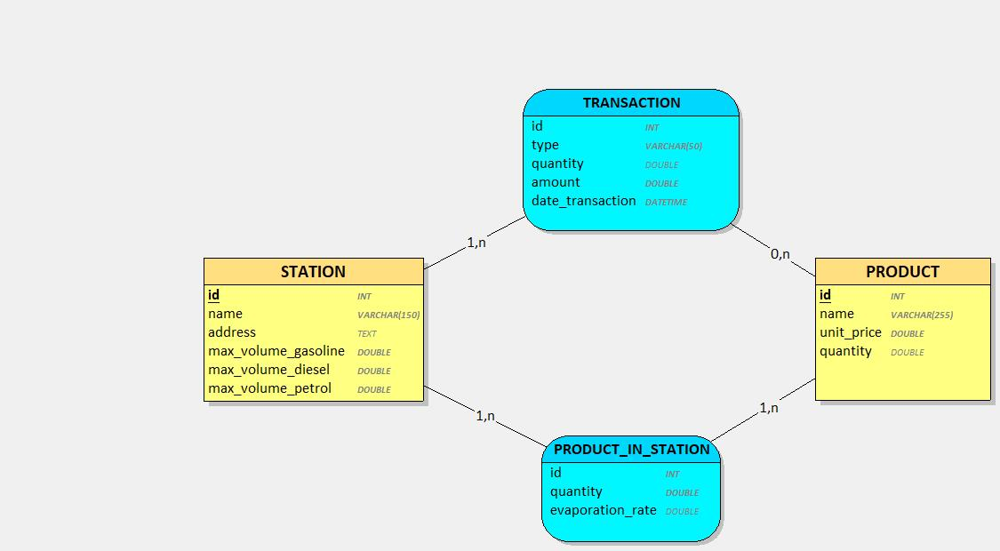

$\mathcal{{Spring \ java \ 21 \ demo } \ \}$

• $\ \ \textcolor{blueviolet}{Gestion  \ des  \ stations  \ service  \ d’une  \ compagnie  \ pétrolière  }$  




````sql

DROP DATABASE IF EXISTS station;
CREATE DATABASE station;

\c  station;

CREATE TABLE IF NOT EXISTS stations
(
    id    SERIAL PRIMARY KEY,
    name  VARCHAR(150) NOT NULL,
    address TEXT,
    max_volume_gasoline DECIMAL(10, 2) NOT NULL,
    max_volume_diesel DECIMAL(10, 2) NOT NULL,
    max_volume_petrol DECIMAL(10, 2) NOT NULL
    );


CREATE TABLE IF NOT EXISTS products
(
    id   SERIAL PRIMARY KEY,
    name VARCHAR(255) NOT NULL,
    unit_price DECIMAL(10, 2) NOT NULL
    );


CREATE TABLE IF NOT EXISTS product_in_station
(
    id   SERIAL PRIMARY KEY,
    station_id  INT REFERENCES stations (id),
    product_id  INT REFERENCES products (id),
    quantity DECIMAL(10, 2),
    evaporation_rate DECIMAL(5, 2) DEFAULT 0.0
    );


CREATE TABLE IF NOT EXISTS transactions
(
    id  SERIAL PRIMARY KEY,
    station_id  INT REFERENCES stations (id),
    product_id  INT REFERENCES products (id),
    type   VARCHAR(50) NOT NULL,
    quantity DECIMAL(10, 2),
    amount DECIMAL(10, 2) NOT NULL,
    date_transaction TIMESTAMP   NOT NULL
    );

````